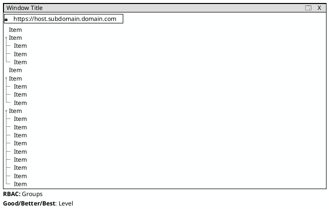

This is a snippet repository for UI mockup, diagram as code and data model illustration, using plantuml and mermaid.

# UI

## Components
### Window

<details>
  
<summary>Show Code</summary>
  


</details>

### Wizard


<details>
  
<summary>Show Code</summary>
  
```puml

```

</details>

### Modal


<details>
  
<summary>Show Code</summary>
  
```puml

```

</details>

### Hierarchical Table


<details>
  
<summary>Show Code</summary>
  
```puml

```

</details>

### Flat Table


<details>
  
<summary>Show Code</summary>
  
```puml

```

</details>

### Tabbed Interface


<details>
  
<summary>Show Code</summary>
  
```puml

```

</details>

### Dashboard Layout


<details>
  
<summary>Show Code</summary>
  
```puml

```

</details>

## All Together


<details>
  
<summary>Show Code</summary>
  
```puml

```

</details>

# Graphs

<details>
  
<summary>Show Code</summary>
  
```puml

```

</details>

# Block
<details>
  
<summary>Show Code</summary>
  
```puml

```

</details>
