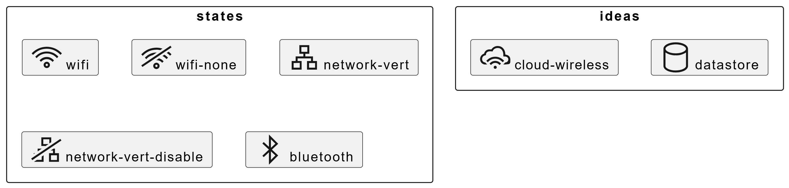

PlantUML and Mermaid snippet repository for 
* [Simple Sprite Library](#simple-sprite-library)
* [Diagram as Code](#diagram-as-code)
* [Data Model Illustration](#data-model-illustration)
* [UI Mockup](#UI-Mockup)

# Simple Sprite Library


## Device Sprites

<details>

<summary>Show Code</summary>
  

</details>

## Architecture Sprites

<details>

<summary>Show Code</summary>
  


# Diagram as Code

## Component


<details>
  
<summary>Show Code</summary>
  


</details>

## Graph


<details>
  
<summary>Show Code</summary>
  
```
graph LR

subgraph Group 1
    Item1
    Item2
    Item3
    Item4
end

subgraph Group 2
    Item5
    Item6
end

subgraph Group 3
    Item7
    Item8
end

Item4 --> Item5
Item3 --> Item5
Item1 --> Item6
Item1 --> Item5
Item2 --> Item6
Item6 --> Item5

Item5 --> Item8
Item8 --> Item7
```

</details>

## Block


<details>
  
<summary>Show Code</summary>
  
```
block-beta
columns 1

  block:Frontend
    Draw.io
    PlantUML
    Mermaid
  end
  
  block:Renderer
    Custom
    Graphviz
 end

PlantUML --> Graphviz
Mermaid --> Graphviz
Draw.io --> Custom
```

</details>

# Data Model Illustration

## JSON

<details>
  
<summary>Show Code</summary>
  


</details>

## YAML


<details>
  
<summary>Show Code</summary>
  


</details>

## ERD


## Hierarchy


<details>
  
<summary>Show Code</summary>
  


</details>

## Parse


<details>
  
<summary>Show Code</summary>
  


</details>

# UI Mockup

## All Together


## Components 
  
<details>
  

  <summary>Show Components</summary>

  ### Window

```puml
@startsalt
skinparam backgroundcolor #FEFFFF
{ 
    {+


{*  Window Title                                                                                        🗔  X}
' Header
    { 
{}
    {+ 🔒  https://host.subdomain.domain.com   }
  
' LeftNav
{}
    {T 
        + Item
        + Item
        ++ Item
        ++ Item
        ++ Item
        + Item
        + Item
        ++ Item
        ++ Item
        ++ Item
        + Item
        ++ Item
        ++ Item
        ++ Item
        ++ Item
        ++ Item
        ++ Item
        ++ Item
        ++ Item
        ++ Item

    }|
' MainPanel


' endMainPanel

    }

}
<b>RBAC:</b> Groups
<b>Good/Better/Best</b>: Level
}


@endsalt
```

<details>
  
<summary>Show Code</summary>
  


</details>

### Wizard

```puml
@startsalt
skinparam backgroundcolor #FEFFFF

{
{*  Wizard}
{+
'Left Menu
{/
    Step 1    
    <b>Step 2    
    <color:gray>Step 3    
}|
{
    { 
      <b>Step Name
            {.}

        {
          Attribute:  | "User-defined value  " 
          <i>Note |          {<i>Lorem ipsum 
        <i>Lorem iupsum}
        {.}
        Textbox  |
        {SI
    something for the user to type into
    
                                           
}
        {.}
        () Bullet| 
        (X) Bullet
        [ ] check|
        [X] Check
          
{.}
        {
        }
        } 
        

    }
    --
{                                                 |[Back] | [Next]|}
}
}
}
@endsalt
```


<details>
  
<summary>Show Code</summary>
  


</details>

### Modal

```puml
@startsalt
skinparam backgroundcolor #FEFFFF

{
{*  Modal}
{+

{
    { 
      <b>Step Name
            {.}

        {
          Attribute:  | "User-defined value  " 
          <i>Note |          {<i>Lorem ipsum 
        <i>Lorem iupsum}
        {.}
        Textbox  |
        {SI
    something for the user to type into
    
                                           
}
        {.}
        () Bullet| 
        (X) Bullet
        [ ] check|
        [X] Check
          
{.}
        {
        }
        } 
        

    }
    --
{                                                 |[Back] | [Next]|}
}
}
}
@endsalt
```


<details>
  
<summary>Show Code</summary>
  


</details>

### Hierarchical Table


<details>
  
<summary>Show Code</summary>
  


</details>

### Flat Table

```puml
@startsalt
{
    <b> Table Name
    â€â€â€â€â€â€â€â€â€â€â€â€â€â€â€â€â€â€â€â€â€â€â€â€          🖠▥ ⟳
    {T-
        ☠<b>Column|<b>Column |<b>Column |<b> Column | <b>Column
        ☠1Level|  ✅ |  Attribute       |Attribute | Attribute Attribute
         ☠2Level|  ✅ |  Attribute       |Attribute| Attribute Attribute
         ☠2Level|  âš ï¸ | Attribute      |Attribute| Attribute Attribute
         ☠3Level|âŒ| Attribute      |Attribute| Attribute Attribute
        ☑ 1Level|  ✅ |  Attribute       |Attribute | Attribute Attribute
        ☠1Level|  ✅ |  Attribute       |Attribute | Attribute Attribute
         ☑ 2Level|  ✅ |  Attribute       |Attribute| Attribute Attribute
         ☑ 2Level|  âš ï¸ | Attribute      |Attribute| Attribute Attribute
         ☑ 3Level|âŒ| Attribute      |Attribute| Attribute Attribute
        ☠1Level|  ✅ |  Attribute       |Attribute | Attribute Attribute
         ☠2Level|  ✅ |  Attribute       |Attribute| Attribute Attribute
         ☠2Level|  ✅ | Attribute      |Attribute| Attribute Attribute
         ☠3Level|✅| Attribute      |Attribute| Attribute Attribute
}
}
@endsalt
```


<details>
  
<summary>Show Code</summary>
  


</details>

### Tabbed Interface

```puml
@startsalt
{{
  {/ Tab  | Tab | Tab | <b>Selected Tab }

{.}
Message to the user
--
{
          Attribute:  | "User-defined value  " 
          <i>Note |          {<i>Lorem ipsum 
        <i>Lorem iupsum}
        {.}
        Textbox  |
        {SI
    something for the user to type into
    
                                           
}
        {.}
        () Bullet| 
        (X) Bullet
        [ ] check|
        [X] Check
        
          
{.}
        {
        }
        } 
        
    }
    
{                                    |[Cancel]| [Action]}}

@endsalt
```


<details>
  
<summary>Show Code</summary>
  


</details>

### Unicode

```puml
@startsalt
{+Unicode
  {🗀
  🗔
  𝄘
  🝖 ▥ ⟳
  ©
  ®
  ⏴
  ⏵
  ⏶
  ⏷
  ⛔
  ✅
  ✨
  ❌
  ❎
  {➕  |
  ➖}
  }|
{ ❗
  ❕
  ❔
  ❓
  ⭐
  ⭕
  {🔁 🔃  📶  🔀  🔂  🔄   }
  {🔓 |
  🔒 |
  🔑}
  {🔔 |
  🔕}
  }
}
@endsalt
```


<details>


  
</details>

### Dashboard Layout

```puml
@startsalt
{
{^==bubble

  <img:https://raw.githubusercontent.com/pgaljan/dac/main/img/bubble.png>
 
 
 
 
 
{}
}|
    {^==map
                                                                  
  <img:https://raw.githubusercontent.com/pgaljan/dac/main/img/map.png>

 { }
}


{^==scatter
 
  <img:https://raw.githubusercontent.com/pgaljan/dac/main/img/scatter.png>
  }|
  {^==veritcal bar
 
 <img:https://raw.githubusercontent.com/pgaljan/dac/main/img/vbar.png>
 }
{^==horizontal bar
 
 <img:https://raw.githubusercontent.com/pgaljan/dac/main/img/hbar.png>
}|
  {^==line
 
 <img:https://raw.githubusercontent.com/pgaljan/dac/main/img/line.png>
}
  {^==graph
 
 <img:https://raw.githubusercontent.com/pgaljan/dac/main/img/graph.png>
}

}

@endsalt

```


<details>
  
<summary>Show Code</summary>
  


</details>

</details>
