PlantUML and Mermaid snippet repository for 
* [Diagram as Code](#diagram-as-code)
* [Data Model Illustration](#data-model-illustration)
* [UI Mockup](#UI-Mockup)

# Diagram as Code


## Graphs

<details>
  
<summary>Show Code</summary>
  
```puml

```

</details>

## Block
<details>
  
<summary>Show Code</summary>
  
```puml

```

</details>

# Data Model Illustration

## JSON
<details>
  
<summary>Show Code</summary>
  
```puml

```

</details>

## YAML
<details>
  
<summary>Show Code</summary>
  
```puml

```

</details>

## ERD


## Hierarchy


<details>
  
<summary>Show Code</summary>
  


</details>

## Parse


<details>
  
<summary>Show Code</summary>
  


</details>

# UI Mockup

## All Together


## Components 
  
<details>
  

  <summary>Show Components</summary>

  ### Window

```puml
@startsalt
skinparam backgroundcolor #FEFFFF
{ 
    {+


{*  Window Title                                                                                        🗔  X}
' Header
    { 
{}
    {+ 🔒  https://host.subdomain.domain.com   }
  
' LeftNav
{}
    {T 
        + Item
        + Item
        ++ Item
        ++ Item
        ++ Item
        + Item
        + Item
        ++ Item
        ++ Item
        ++ Item
        + Item
        ++ Item
        ++ Item
        ++ Item
        ++ Item
        ++ Item
        ++ Item
        ++ Item
        ++ Item
        ++ Item

    }|
' MainPanel


' endMainPanel

    }

}
<b>RBAC:</b> Groups
<b>Good/Better/Best</b>: Level
}


@endsalt
```

<details>
  
<summary>Show Code</summary>
  


</details>

### Wizard

```puml
@startsalt
skinparam backgroundcolor #FEFFFF

{
{*  Wizard}
{+
'Left Menu
{/
    Step 1    
    <b>Step 2    
    <color:gray>Step 3    
}|
{
    { 
      <b>Step Name
            {.}

        {
          Attribute:  | "User-defined value  " 
          <i>Note |          {<i>Lorem ipsum 
        <i>Lorem iupsum}
        {.}
        Textbox  |
        {SI
    something for the user to type into
    
                                           
}
        {.}
        () Bullet| 
        (X) Bullet
        [ ] check|
        [X] Check
          
{.}
        {
        }
        } 
        

    }
    --
{                                                 |[Back] | [Next]|}
}
}
}
@endsalt
```


<details>
  
<summary>Show Code</summary>
  


</details>

### Modal

```puml
@startsalt
skinparam backgroundcolor #FEFFFF

{
{*  Modal}
{+

{
    { 
      <b>Step Name
            {.}

        {
          Attribute:  | "User-defined value  " 
          <i>Note |          {<i>Lorem ipsum 
        <i>Lorem iupsum}
        {.}
        Textbox  |
        {SI
    something for the user to type into
    
                                           
}
        {.}
        () Bullet| 
        (X) Bullet
        [ ] check|
        [X] Check
          
{.}
        {
        }
        } 
        

    }
    --
{                                                 |[Back] | [Next]|}
}
}
}
@endsalt
```


<details>
  
<summary>Show Code</summary>
  


</details>

### Hierarchical Table


<details>
  
<summary>Show Code</summary>
  


</details>

### Flat Table

```puml
@startsalt
{
    <b> Table Name
    â€â€â€â€â€â€â€â€â€â€â€â€â€â€â€â€â€â€â€â€â€â€â€â€          🖠▥ ⟳
    {T-
        ☠<b>Column|<b>Column |<b>Column |<b> Column | <b>Column
        ☠1Level|  ✅ |  Attribute       |Attribute | Attribute Attribute
         ☠2Level|  ✅ |  Attribute       |Attribute| Attribute Attribute
         ☠2Level|  âš ï¸ | Attribute      |Attribute| Attribute Attribute
         ☠3Level|âŒ| Attribute      |Attribute| Attribute Attribute
        ☑ 1Level|  ✅ |  Attribute       |Attribute | Attribute Attribute
        ☠1Level|  ✅ |  Attribute       |Attribute | Attribute Attribute
         ☑ 2Level|  ✅ |  Attribute       |Attribute| Attribute Attribute
         ☑ 2Level|  âš ï¸ | Attribute      |Attribute| Attribute Attribute
         ☑ 3Level|âŒ| Attribute      |Attribute| Attribute Attribute
        ☠1Level|  ✅ |  Attribute       |Attribute | Attribute Attribute
         ☠2Level|  ✅ |  Attribute       |Attribute| Attribute Attribute
         ☠2Level|  ✅ | Attribute      |Attribute| Attribute Attribute
         ☠3Level|✅| Attribute      |Attribute| Attribute Attribute
}
}
@endsalt
```


<details>
  
<summary>Show Code</summary>
  


</details>

### Tabbed Interface

```puml
@startsalt
{{
  {/ Tab  | Tab | Tab | <b>Selected Tab }

{.}
Message to the user
--
{
          Attribute:  | "User-defined value  " 
          <i>Note |          {<i>Lorem ipsum 
        <i>Lorem iupsum}
        {.}
        Textbox  |
        {SI
    something for the user to type into
    
                                           
}
        {.}
        () Bullet| 
        (X) Bullet
        [ ] check|
        [X] Check
        
          
{.}
        {
        }
        } 
        
    }
    
{                                    |[Cancel]| [Action]}}

@endsalt
```


<details>
  
<summary>Show Code</summary>
  


</details>

### Dashboard Layout

```puml
@startsalt
{
{^==Widget
 Note on top
 <img:https://plantuml.com/logo3.png>
}|
    {^==Widget
note
 <img:https://plantuml.com/logo3.png>
}


{^==Widget
 second row first column
 <img:https://plantuml.com/logo3.png>
}|
  {^==Widget
 second row 2nd column
 <img:https://plantuml.com/logo3.png>
}
}

@endsalt
```


<details>
  
<summary>Show Code</summary>
  


</details>

</details>
