PlantUML and Mermaid snippet repository for rapid diagramming and data modeling, and UX iteration


* [Diagram as Code](#diagram-as-code)
* [UI Spec as Code](#UI-Spec)
* [Data Model Illustration](#data-model-illustration)
* [Simple Sprite Library](#simple-sprite-library)
  
# Diagram as Code

## Example:  MLOps Workflow


<details>
<summary>Show Code</summary>

```
@startuml
!include <logos/prometheus>
!include <elastic/beats/beats>
!include <elastic/endpoint/endpoint>
!include <logos/git-icon>
!include <logos/kafka-icon>
!include <tupadr3/devicons2/mongodb>
!include <logos/mongodb-icon>
!include <logos/grafana>
!include <logos/apache>
!include <logos/facebook>

Title MLOps Pipeline
rectangle "Data Ingestion" {
    rectangle filebeat as "<$beats*.25> Filebeat\n<color:gray><size:9>Unstructured, Logs"
    rectangle telegraf as "Telegraf\n<color:gray><size:9>Metrics"
    rectangle prometheus as "<$prometheus*.4> Prometheus\n<color:gray><size:9>Alerts"
    rectangle gitops as "<$git-icon*.5> GitOps Agent\n<color:gray><size:9>Configuration drift"
    rectangle elasticAgent as "<$endpoint*.25> Elastic Agent\n<color:gray><size:9>Security Events"
    rectangle kafka as "<$kafka-icon*.3> Kafka\n<color:gray><size:9>Message Bus"
}
rectangle "Data Processing" {
    rectangle flink as "<$apache*.3> Flink\n<color:gray><size:9>Streaming Data Processing"
    rectangle spark as "<$apache*.3> Spark\n<color:gray><size:9>Aggregation & Transformation"
    rectangle feast as "Feast\n<color:gray><size:9>Feature Store"
    rectangle prophet as "<$facebook*.3> Prophet\n<color:gray><size:9>Anomaly Detection" 
}
rectangle "Data Storage" {
    rectangle timescaledb as "TimescaleDB\n<color:gray><size:9>Timeseries Data Store"
    rectangle mongodb as "<$mongodb-icon*.2> MongoDB\n<color:gray><size:9>Unstrucured data store"
    rectangle minio as "MinIO\n<color:gray><size:9>Object Store"
    rectangle PostgresSQL as "MinIO\n<color:gray><size:9>Structured data"
}
rectangle "ML Pipeline" {
    rectangle mlflow as "MLFlow\n<color:gray><size:9>ML orchestration"
    rectangle trainingpipeline as "Training Pipeline"
    rectangle modelregistry as "Model Registry\n<color:gray><size:9>Model registry"
    rectangle seldoncore as "Seldon Core\n<color:gray><size:9>Advanced serving patterns\n<color:gray><size:9>(canary, shadow)"
    rectangle inferenceapi as "Inference API"
}
rectangle "Observability" {
    rectangle grafana as "<$grafana*.35> Grafana\n<color:gray><size:9>Visualization"
    rectangle evidentlyai as "Evidently AI\n<color:gray><size:9>Model performance\n<color:gray><size:9>& drift"
    queue pipeline {
    rectangle modelmonitoring as "Model Monitoring"
    rectangle driftdetection as "Drift Detection"
    rectangle retrainingtrigger as "Retraining Trigger"
}
}
rectangle "Feedback Loop" {
    rectangle humandfeedback as "Human Feedback\n<color:gray><size:9>Human training"
    rectangle activelearning as "Active Learning\n<color:gray><size:9>Ambiguous samples"
}

filebeat --> kafka
telegraf --> kafka
prometheus --> kafka
gitops --> kafka
elasticAgent --> kafka

kafka--> flink

flink--> spark
flink --> feast
flink --> prophet 

spark --> timescaledb
spark --> mongodb
feast --> minio
prophet --> minio

minio --> mlflow
mlflow --> trainingpipeline
trainingpipeline --> modelregistry
modelregistry --> seldoncore
seldoncore --> inferenceapi

inferenceapi --> humandfeedback
humandfeedback --> activelearning
activelearning --> trainingpipeline

seldoncore --> evidentlyai
evidentlyai--> modelmonitoring
modelmonitoring --> driftdetection
driftdetection --> retrainingtrigger
driftdetection--> trainingpipeline

mongodb --> grafana
timescaledb --> grafana
grafana --> humandfeedback
@enduml
```
</details>

## Example:  Enterprise AI Ecosystem


<details>

<summary>Show Code</summary>


</details>


## Example:  Network Diagram


<details>


</details>

## Component


<details>
  
<summary>Show Code</summary>
  


</details>

## Block


<details>
  
<summary>Show Code</summary>
  
```
block-beta
columns 1

  block:Frontend
    Draw.io
    PlantUML
    Mermaid
  end
  
  block:Renderer
    Custom
    Graphviz
 end

PlantUML --> Graphviz
Mermaid --> Graphviz
Draw.io --> Custom
```

</details>


# UI Spec

## Web UI Spec Template


<details>

  <summary>Show Code</summary>

```plantuml
@startsalt
skinparam backgroundcolor #FEFFFF


{
{+
{ 
{
' Tabs
    {/  <b>Active  | <color:gray> Inactive  }                                                                         🗕 <&browser>  🗙}

' Browser bar
    {. 🡐 ⟳ ⌂ |{+  <&lock-locked>  https://url.anydomain.com                             }}
--

' Banner
    {*<back:08206E><color:white>  Banner                                                                                          ⚙ 🛈 🤵}
{

 
' LeftNav
{
    <b>LeftNav
    {T 
        + LandingPage
        + <b>ActivePage
        + Administration
        ++ Submenu


    }
}|

' MainPanelHeader
{
    <b><back:08206E><color:white>ActivePage
    <i><color:08206E>informational text
' MainPanel
{
        {[Action]|.|^Menu^|      🝖 ▥ ⟳}
    {T-
        .|☐ | S | F |Label⏶|<b>Column 
        <b><color:red>⌦ |☐| | <color:darkgreen>⚑ | ♺ |Label | Attribute 
        <b><color:red>⌦ |☐| ⚐ | <color:darkorange>☢ |Label🏷️|  Attribute
        <b><color:red>⌦ |☐| <color:red>⚑ | S |Label | Attribute 
        <b><color:red>⌦ |☐| <color:darkred>🛇 | S |Label | Attribute 
        <b><color:red>⌦ |☐| ⚐ | S |Label| Attribute 
 
    }

}| |
{^"<b>Filter "
{
      { { <b>Saved Filters : 
     ^       ^^ Filter1<color:darkgreen>⚑ ^^ Filter2<color:red>⚑^^<i><color:gray> Filter3</i>^
}|
{
{           { Label: |     |{+       } }
           { Attribute: |  |{+       } }
           {N: | ( ) True | (X) False}
           { Tag:        |{+^  Key   ^ |^ Value^}} }}

           }}}}}}
           
           }
'Footer
{
     {(X) Good  | () Better  | () Best}
     {[X] SaaS  | [X] On-Prem  | [X] Disconnected}

     --
    {
        <b>         Administrator  | [X] View | [X] Edit 
        <b>                              Author | [X] View | [ ] Edit
        <b>                    Contributor | [X] View | [ ] Edit
        <b>                    Commenter | [X] View | [ ] Edit
        <b>               Viewer | [X] View | [ ] Edit
    }

    }

}

@endsalt

```
</details>


## Mobile UI Spec Template


<details>

  <summary>Show Code</summary>

```plantuml

@startsalt
skinparam rectangle rounded
{+
' Device Status
    {1:48  <&bell>                           <&wifi> <&battery-full>}
--
'Dashboard
{
               <&cloudy*3>
          <&location>Anytown, USA
               <size:20>49°
           Feels like: 43°
            H: 52° L: 38°
}
--
'Summary
{
<size:9>Cloudy conditions will contiooue for the rest of the day.
<size:9>Wind gusts up to 17mph are making the temperature 
<size:9>feel like like 43.
    
    
    {
              | 6p | 7p | 8p | 9p | 10p
              |<&cloudy>| <&bolt*1.5> | <&cloudy>| <&sun>| <&cloudy>
               | 50° | 51° | 52° | 50° | 48°     
     }

}
--
'Detail
<b>Details
{T-
    <&chevron-right*2> | <&location>Details | <i>Details| .| .|.|.| .|.|.
    <&chevron-right*2> | <&location>Details | <i>Details
    <&chevron-right*2> | <&location>Details| <i>Details
    <&chevron-right*2> | <&location>Details| <i>Details
    <&chevron-right*2> | <&location>Details| <i>Details
} 

{

}
--
{
     <&home*4>                        <&share*4>
}
}


@endsa

```
</details>


## Components 
  
<details>

  

  <summary>Show Components</summary>

### Useful Unicode


<details>
  
<summary>Show Code</summary>

```puml
@startsalt
 
' Unicode characters don't scale but they 
' render more reliably and result in more 
' readable markup than sprites and 
' openiconic
' https://www.vertex42.com/ExcelTips/unicode-symbols.html

{+Unicode icons
  {
{
    🗀  ⚙
  ▁  🗔   🗙
  𝄘 ≡ ☰
  🗕  ⤓  ⤒  🔗  
  🝖 ▥ 
  	↩ ↪ ↶  ↷
  🡐 ⟳ ⌂ ⟰
  🛇 🛈  © ®
  ⏴ ⏵  ⏶  ⏷
   ⌨ ⌧ ⌦ ⏱
  ⏭   ⏮    ⏯
  ▣ ◼ ☑ ▢ 
  ⦿  🔘☢ ◉
  ✂ ⎘  🛆
  }|
{
{    
  ← ↑ → ↓ 
  ↔ ↕ 
  ⇤ ⇥ ⤒ ⤓
  ↖ ↗ ↘ ↙ 
  ⤸ ⤹ ⤺ ⤻
  ⤴ ⤵ ⤶ ⤷	
☰ ☱ ☲ ☳	
☴ ☵ ☶ ☷
♺ ♻ ♼
⚐ ⚑

𝄘 𝄙 𝄚 𝄛
}|
{

🕐 🕑 🕒       🕓 
🕔 🕕 🕖       🕗
🕘 🕙 🕚       🕛 
🕜 🕝 🕞       🕟
🕠 🕡 🕢       🕣
🕤 🕥 🕦       🕧
① ② ③ ④ 
  ⑤ ⑥ ⑦ ⑧ 
  ⑨ ⑩ ⑪ ⑫ 
  ⑬ ⑭ ⑮ ⑯ 
  ⑰ ⑱ ⑲ ⑳
  }
}
  }|
  {
  ❗❕  ❔  ❓  ⭐        ⭕
  🔁 🔃  📶   🔀  🔂     🔄
  🆕   ℹ️   ⚠️  ❌  ⛔ 💡
  🔓    🔒   🔑
    ⛔    ✅  ✨    ❎ ⭐
  ➕     ➖ 🟰
   🔔      🔕 ⌛

  ⌚    ⌛    🚩  🚫  🚀
  ⏩   ⏪   ⏫     ⏬
  🔎   🔍     🍳  📍    📌
  
  }|

}
@endsalt
```

 </details> 

### Manual box-drawing


<details>
  
<summary>Show Code</summary>

```puml
@startsalt

{+Unicode box drawing                                                                                                                           
    ─	━	│	┃	┄	┅	┆	┇	┈	┉	┊	┋ 
┌	┍	┎	┏	┐	┑	┒	┓	└	┕	┖	┗
┘	┙	┚	┛	├	┝	┞	┟	┠	┡	┢	┣
┤	┥	┦	┧	┨	┩	┪	┫	┬	┭	┮
	┯
┰	┱	┲	┳	┴	┵	┶	┷	┸	┹	┺	┻
┼	┽	┾	┿	╀	╁	╂	╃	╄	╅	╆	╇
╈	╉	╊	╋	╌	╍	╎	╏	═	║	╒	╓
╔	╕	╖	╗	╘	╙	╚	╛	╜	╝	╞	╟
╠	╡	╢	╣	╤	╥	╦	╧	╨
	╩	╪	╫ ╬	╭	╮	╯	╰	╱	╲
	╳	╴	╵	╶	╷ ╸	╹	╺	╻	╼	╽	╾╿
  
}
@endsalt
```

 </details> 


  ### Window

<details>
  
<summary>Show Code</summary>
  
```puml
@startsalt
skinparam backgroundcolor #FEFFFF
{ 
    {+


{*  Window Title                                                                                        🗔  X}
' Header
    { 
{}
    {+ 🔒  https://host.subdomain.domain.com   }
  
' LeftNav
{}
    {T 
        + Item
        + Item
        ++ Item
        ++ Item
        ++ Item
        + Item
        + Item
        ++ Item
        ++ Item
        ++ Item
        + Item
        ++ Item
        ++ Item
        ++ Item
        ++ Item
        ++ Item
        ++ Item
        ++ Item
        ++ Item
        ++ Item

    }|
' MainPanel


' endMainPanel

    }

}
<b>RBAC:</b> Groups
<b>Good/Better/Best</b>: Level
}


@endsalt
```

</details>

### Wizard


<details>
  
<summary>Show Code</summary>
  
```puml
@startsalt
skinparam backgroundcolor #FEFFFF

{
{*  Wizard}
{+
'Left Menu
{/
    Step 1    
    <b>Step 2    
    <color:gray>Step 3    
}|
{
    { 
      <b>Step Name
            {.}

        {
          Attribute:  | "User-defined value  " 
          <i>Note |          {<i>Lorem ipsum 
        <i>Lorem iupsum}
        {.}
        Textbox  |
        {SI
    something for the user to type into
    
                                           
}
        {.}
        () Bullet| 
        (X) Bullet
        [ ] check|
        [X] Check
          
{.}
        {
        }
        } 
        

    }
    --
{                                                 |[Back] | [Next]|}
}
}
}
@endsalt
```

</details>

### Modal


<details>
  
<summary>Show Code</summary>
  
```puml
@startsalt
skinparam backgroundcolor #FEFFFF

{
{*  Modal}
{+

{
    { 
      <b>Step Name
            {.}

        {
          Attribute:  | "User-defined value  " 
          <i>Note |          {<i>Lorem ipsum 
        <i>Lorem iupsum}
        {.}
        Textbox  |
        {SI
    something for the user to type into
    
                                           
}
        {.}
        () Bullet| 
        (X) Bullet
        [ ] check|
        [X] Check
          
{.}
        {
        }
        } 
        

    }
    --
{                                                 |[Back] | [Next]|}
}
}
}
@endsalt
```

</details>


### Hierarchical Table


<details>
  
<summary>Show Code</summary>
  

</details>

### Flat Table


<details>
  
<summary>Show Code</summary>
  
```puml
@startsalt
{
    <b> Table Name
    â€â€â€â€â€â€â€â€â€â€â€â€â€â€â€â€â€â€â€â€â€â€â€â€          🖠▥ ⟳
    {T-
        ☠<b>Column|<b>Column |<b>Column |<b> Column | <b>Column
        ☠1Level|  ✅ |  Attribute       |Attribute | Attribute Attribute
         ☠2Level|  ✅ |  Attribute       |Attribute| Attribute Attribute
         ☠2Level|  âš ï¸ | Attribute      |Attribute| Attribute Attribute
         ☠3Level|âŒ| Attribute      |Attribute| Attribute Attribute
        ☑ 1Level|  ✅ |  Attribute       |Attribute | Attribute Attribute
        ☠1Level|  ✅ |  Attribute       |Attribute | Attribute Attribute
         ☑ 2Level|  ✅ |  Attribute       |Attribute| Attribute Attribute
         ☑ 2Level|  âš ï¸ | Attribute      |Attribute| Attribute Attribute
         ☑ 3Level|âŒ| Attribute      |Attribute| Attribute Attribute
        ☠1Level|  ✅ |  Attribute       |Attribute | Attribute Attribute
         ☠2Level|  ✅ |  Attribute       |Attribute| Attribute Attribute
         ☠2Level|  ✅ | Attribute      |Attribute| Attribute Attribute
         ☠3Level|✅| Attribute      |Attribute| Attribute Attribute
}
}
@endsalt
```

</details>

### Tabbed Interface


<details>
  
<summary>Show Code</summary>
  
```puml
@startsalt
{{
  {/ Tab  | Tab | Tab | <b>Selected Tab }

{.}
Message to the user
--
{
          Attribute:  | "User-defined value  " 
          <i>Note |          {<i>Lorem ipsum 
        <i>Lorem iupsum}
        {.}
        Textbox  |
        {SI
    something for the user to type into
    
                                           
}
        {.}
        () Bullet| 
        (X) Bullet
        [ ] check|
        [X] Check
        
          
{.}
        {
        }
        } 
        
    }
    
{                                    |[Cancel]| [Action]}}

@endsalt
```

</details>

### Unicode


<details>

```puml
@startsalt
{+Unicode
  {🗀
  🗔
  𝄘
  🝖 ▥ ⟳
  ©
  ®
  ⏴
  ⏵
  ⏶
  ⏷
  ⛔
  ✅
  ✨
  ❌
  ❎
  {➕  |
  ➖}
  }|
{ ❗
  ❕
  ❔
  ❓
  ⭐
  ⭕
  {🔁 🔃  📶  🔀  🔂  🔄   }
  {🔓 |
  🔒 |
  🔑}
  {🔔 |
  🔕}
  }
}
@endsalt
```
  
</details>

### Dashboard Layout


<details>
  
<summary>Show Code</summary>
  
```puml
@startsalt
{
{^==bubble

  <img:https://raw.githubusercontent.com/pgaljan/dac/main/img/bubble.png>
 
 
 
 
 
{}
}|
    {^==map
                                                                  
  <img:https://raw.githubusercontent.com/pgaljan/dac/main/img/map.png>

 { }
}


{^==scatter
 
  <img:https://raw.githubusercontent.com/pgaljan/dac/main/img/scatter.png>
  }|
  {^==veritcal bar
 
 <img:https://raw.githubusercontent.com/pgaljan/dac/main/img/vbar.png>
 }
{^==horizontal bar
 
 <img:https://raw.githubusercontent.com/pgaljan/dac/main/img/hbar.png>
}|
  {^==line
 
 <img:https://raw.githubusercontent.com/pgaljan/dac/main/img/line.png>
}
  {^==graph
 
 <img:https://raw.githubusercontent.com/pgaljan/dac/main/img/graph.png>
}

}

@endsalt

```

</details>

</details>

# Simple Sprite Library


## Device Sprites

<details>

<summary>Show Code</summary>
  

</details>

## Architecture Sprites


<details>

<summary>Show Code</summary>
  

</details>

## Icon Sprites


<details>
  
<summary>Show Code</summary>
  


</details>


## Cloud Sprites


<details>
  
<summary>Show Code</summary>
  

</details>

# Data Model Illustration

## JSON


<details>
  
<summary>Show Code</summary>
  
```puml
@startjson
title JSON
{
    "Microsoft" : {
        "O365" : "",

        "Power Platform" : "",
        "VSCode" : [
            "PlantUML",
            "Draw.io",
            "Mermaid"
        ]
    },
    "Miro" : [
            "PlantUML",
            "Draw.io",
            "Mermaid"
        ],
    "Atlassian" : [
        "Jira",
        "Confluence",
        "Align"
    ],
    "Adobe" : [
        "Figma",
        "FigJam"
    ]
}
@endjson
```

</details>

## YAML


<details>
  
<summary>Show Code</summary>
  
```puml
@startyaml
title YAML
Microsoft:
  O365: ""
  Power Platform: ""
  VSCode:
  - PlantUML
  - Draw.io
  - Mermaid
Miro:
- PlantUML
- Draw.io
- Mermaid
Atlassian:
- Jira
- Confluence
- Align
Adobe:
- Figma
- FigJam
@endyaml
```

</details>

## Hierarchy


<details>
  
<summary>Show Code</summary>
  
```puml
@startsalt
{
{T 
        + Item
        + Item
        ++ Item
        ++ Item
        +++ Item
        ++ Item
        + Item
        + Item
        ++ Item

    }
}
@endsalt
```

</details>

## Parse


<details>
  
<summary>Show Code</summary>
  
```puml
@startregex
title Regex Parsing

/^([a-z0-9_\.-]+)@([\da-z\.-]+)\.([a-z\.]{2,63})$/
@endregex
```

</details>
