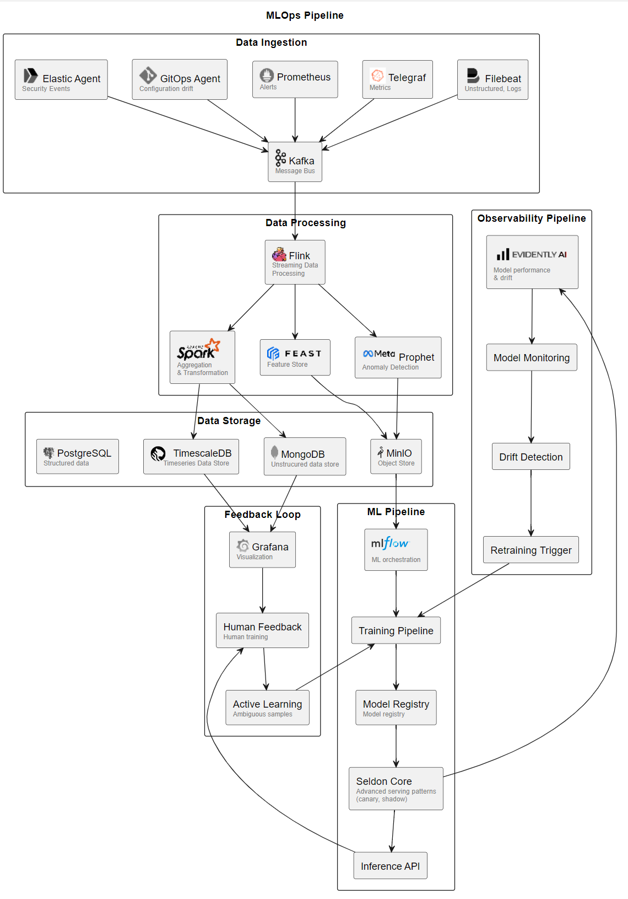
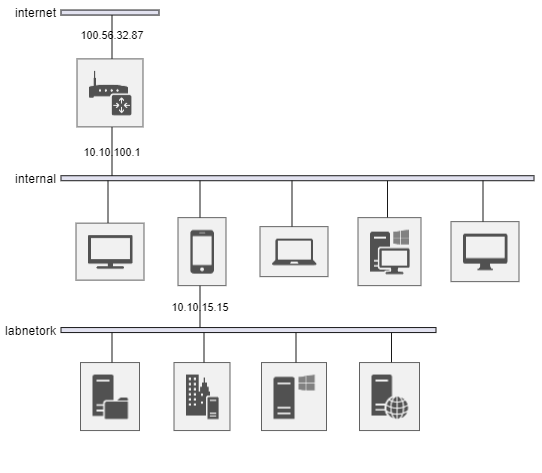

# Diagram as Code

## Example:  MLOps Workflow


<i> note:  some of the sprites are locally loaded

<details>
<summary>Show Code</summary>

```
@startuml
!include <logos/prometheus>
!include <elastic/beats/beats>
!include <elastic/endpoint/endpoint>
!include <logos/git-icon>
!include <logos/kafka-icon>
!include <tupadr3/devicons2/mongodb>
!include <logos/mongodb-icon>
!include <logos/grafana>
!include <logos/apache>
!include <logos/facebook>
!include <logos/postgresql>
sprite mlflow ../img/mlflow.svg
sprite evidentlyai ../img/evidentlyai.png
sprite timescale ../img/timescale.svg
sprite feast ../img/feast_logo.png
sprite spark ../img/spark.png
sprite flink ../img/flink.png
sprite metaverse ../img/meta.png
sprite telegraf ../img/telegraf.png
sprite minio ../img/MINIO_Bird.png

Title MLOps Pipeline
rectangle "Data Ingestion" {
    rectangle filebeat as "<$beats*.25> Filebeat\n<color:gray><size:9>Unstructured, Logs"
    rectangle telegraf as "<$telegraf*.1> Telegraf\n<color:gray><size:9>Metrics"
    rectangle prometheus as "<$prometheus*.4> Prometheus\n<color:gray><size:9>Alerts"
    rectangle gitops as "<$git-icon*.5> GitOps Agent\n<color:gray><size:9>Configuration drift"
    rectangle elasticAgent as "<$endpoint*.25> Elastic Agent\n<color:gray><size:9>Security Events"
    rectangle kafka as "<$kafka-icon*.3> Kafka\n<color:gray><size:9>Message Bus"
}
rectangle "Data Processing" {
    rectangle flink as "<$flink*.2> Flink\n<color:gray><size:9>Streaming Data\n<color:gray><size:9>Processing"
    rectangle spark as "<$spark*.06>\n<color:gray><size:9>Aggregation\n<color:gray><size:9>& Transformation"
    rectangle feast as "<$feast*.015>\n<color:gray><size:9>Feature Store"
    rectangle prophet as "<$metaverse*.03> Prophet\n<color:gray><size:9>Anomaly Detection" 
}
rectangle "Data Storage" {
    rectangle timescaledb as "<$timescale*.015>\n        TimescaleDB\n<color:gray><size:9>      Timeseries Data Store"
    rectangle mongodb as "<$mongodb-icon*.2> MongoDB\n<color:gray><size:9>Unstrucured data store"
    rectangle minio as "<$minio*.015> MinIO\n<color:gray><size:9>Object Store"
    rectangle PostgresSQL as "<$postgresql*.3> PostgreSQL\n<color:gray><size:9>Structured data"
}
rectangle "ML Pipeline" {
    rectangle mlflow as "<$mlflow*.5>\n\n<color:gray><size:9>ML orchestration"
    rectangle trainingpipeline as "Training Pipeline"
    rectangle modelregistry as "Model Registry\n<color:gray><size:9>Model registry"
    rectangle seldoncore as "Seldon Core\n<color:gray><size:9>Advanced serving patterns\n<color:gray><size:9>(canary, shadow)"
    rectangle inferenceapi as "Inference API"
}

    rectangle "Observability Pipeline" {
        rectangle evidentlyai as "<$evidentlyai*.15>\n<color:gray><size:9>Model performance\n<color:gray><size:9>& drift"
        rectangle modelmonitoring as "Model Monitoring"
        rectangle driftdetection as "Drift Detection"
        rectangle retrainingtrigger as "Retraining Trigger"

}
rectangle "Feedback Loop" {
    rectangle grafana as "<$grafana*.35> Grafana\n<color:gray><size:9>Visualization"
    rectangle humandfeedback as "Human Feedback\n<color:gray><size:9>Human training"
    rectangle activelearning as "Active Learning\n<color:gray><size:9>Ambiguous samples"
}

filebeat --> kafka
telegraf --> kafka
prometheus --> kafka
gitops --> kafka
elasticAgent --> kafka

kafka--> flink

flink--> spark
flink --> feast
flink --> prophet 

spark --> timescaledb
spark --> mongodb
feast --> minio
prophet --> minio

minio --> mlflow
mlflow --> trainingpipeline
trainingpipeline --> modelregistry
modelregistry --> seldoncore
seldoncore --> inferenceapi

inferenceapi --> humandfeedback
humandfeedback --> activelearning
activelearning --> trainingpipeline

seldoncore -up-> evidentlyai
evidentlyai--> modelmonitoring
modelmonitoring --> driftdetection
driftdetection --> retrainingtrigger
retrainingtrigger --> trainingpipeline

mongodb --> grafana
timescaledb --> grafana
grafana --> humandfeedback
@enduml


```
</details>

## Example:  Enterprise AI Ecosystem


<details>

<summary>Show Code</summary>


</details>


## Example:  Network Diagram


<details>


</details>

## Component


<details>
  
<summary>Show Code</summary>
  


</details>

## Block


<details>
  
<summary>Show Code</summary>
  
```
block-beta
columns 1

  block:Frontend
    Draw.io
    PlantUML
    Mermaid
  end
  
  block:Renderer
    Custom
    Graphviz
 end

PlantUML --> Graphviz
Mermaid --> Graphviz
Draw.io --> Custom
```

</details>


