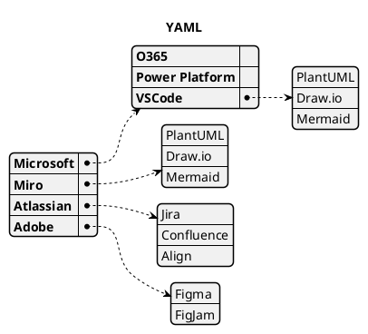
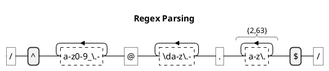

# Data Model Illustration

## JSON

  

Show Code

  

```puml
@startjson
title JSON
{
    "Microsoft" : {
        "O365" : "",

        "Power Platform" : "",
        "VSCode" : [
            "PlantUML",
            "Draw.io",
            "Mermaid"
        ]
    },
    "Miro" : [
            "PlantUML",
            "Draw.io",
            "Mermaid"
        ],
    "Atlassian" : [
        "Jira",
        "Confluence",
        "Align"
    ],
    "Adobe" : [
        "Figma",
        "FigJam"
    ]
}
@endjson
```

## YAML

  

Show Code

  

```puml
@startyaml
title YAML
Microsoft:
  O365: ""
  Power Platform: ""
  VSCode:
  - PlantUML
  - Draw.io
  - Mermaid
Miro:
- PlantUML
- Draw.io
- Mermaid
Atlassian:
- Jira
- Confluence
- Align
Adobe:
- Figma
- FigJam
@endyaml
```

## Hierarchy

  

Show Code

  

```puml
@startsalt
{
{T 
        + Item
        + Item
        ++ Item
        ++ Item
        +++ Item
        ++ Item
        + Item
        + Item
        ++ Item

    }
}
@endsalt
```

## Parse

  

Show Code

  

```puml
@startregex
title Regex Parsing

/^([a-z0-9_\.-]+)@([\da-z\.-]+)\.([a-z\.]{2,63})$/
@endregex
```

