# UI Spec
## Finished spec templates

### Web UI Spec Template

  
Show Code

```plantuml
@startsalt
skinparam backgroundcolor #FEFFFF


{
{+
{ 
{
' Tabs
    {/  <b>Active  | <color:gray> Inactive  }                                                                         🗕 <&browser>  🗙}

' Browser bar
    {. 🡐 ⟳ ⌂ |{+  <&lock-locked>  https://url.anydomain.com                             }}
--

' Banner
    {*<back:08206E><color:white>  Banner                                                                                          ⚙ 🛈 🤵}
{

 
' LeftNav
{
    <b>LeftNav
    {T 
        + LandingPage
        + <b>ActivePage
        + Administration
        ++ Submenu


    }
}|

' MainPanelHeader
{
    <b><back:08206E><color:white>ActivePage
    <i><color:08206E>informational text
' MainPanel
{
        {[Action]|.|^Menu^|      🝖 ▥ ⟳}
    {T-
        .|☐ | S | F |Label⏶|<b>Column 
        <b><color:red>⌦ |☐| | <color:darkgreen>⚑ | ♺ |Label | Attribute 
        <b><color:red>⌦ |☐| ⚐ | <color:darkorange>☢ |Label🏷️|  Attribute
        <b><color:red>⌦ |☐| <color:red>⚑ | S |Label | Attribute 
        <b><color:red>⌦ |☐| <color:darkred>🛇 | S |Label | Attribute 
        <b><color:red>⌦ |☐| ⚐ | S |Label| Attribute 
 
    }

}| |
{^"<b>Filter "
{
      { { <b>Saved Filters : 
     ^       ^^ Filter1<color:darkgreen>⚑ ^^ Filter2<color:red>⚑^^<i><color:gray> Filter3</i>^
}|
{
{           { Label: |     |{+       } }
           { Attribute: |  |{+       } }
           {N: | ( ) True | (X) False}
           { Tag:        |{+^  Key   ^ |^ Value^}} }}

           }}}}}}
           
           }
'Footer
{
     {(X) Good  | () Better  | () Best}
     {[X] SaaS  | [X] On-Prem  | [X] Disconnected}

     --
    {
        <b>         Administrator  | [X] View | [X] Edit 
        <b>                              Author | [X] View | [ ] Edit
        <b>                    Contributor | [X] View | [ ] Edit
        <b>                    Commenter | [X] View | [ ] Edit
        <b>               Viewer | [X] View | [ ] Edit
    }

    }

}

@endsalt

```

### Mobile UI Spec Template
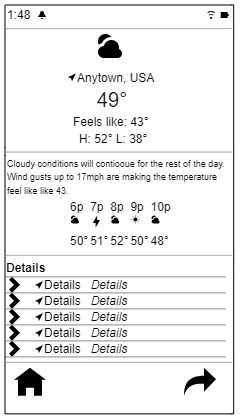

  
Show Code

```plantuml

@startsalt
skinparam rectangle rounded
{+
' Device Status
    {1:48  <&bell>                           <&wifi> <&battery-full>}
--
'Dashboard
{
               <&cloudy*3>
          <&location>Anytown, USA
               <size:20>49°
           Feels like: 43°
            H: 52° L: 38°
}
--
'Summary
{
<size:9>Cloudy conditions will contiooue for the rest of the day.
<size:9>Wind gusts up to 17mph are making the temperature 
<size:9>feel like like 43.
    
    
    {
              | 6p | 7p | 8p | 9p | 10p
              |<&cloudy>| <&bolt*1.5> | <&cloudy>| <&sun>| <&cloudy>
               | 50° | 51° | 52° | 50° | 48°     
     }

}
--
'Detail
<b>Details
{T-
    <&chevron-right*2> | <&location>Details | <i>Details| .| .|.|.| .|.|.
    <&chevron-right*2> | <&location>Details | <i>Details
    <&chevron-right*2> | <&location>Details| <i>Details
    <&chevron-right*2> | <&location>Details| <i>Details
    <&chevron-right*2> | <&location>Details| <i>Details
} 

{

}
--
{
     <&home*4>                        <&share*4>
}
}


@endsa

```

## Assembled Components 
  

  

  
Show Components

### Useful Unicode

  

Show Code

```puml
@startsalt
 
' Unicode characters don't scale but they 
' render more reliably and result in more 
' readable markup than sprites and 
' openiconic
' https://www.vertex42.com/ExcelTips/unicode-symbols.html

{+Unicode icons
  {
{
    🗀  ⚙
  ▁  🗔   🗙
  𝄘 ≡ ☰
  🗕  ⤓  ⤒  🔗  
  🝖 ▥ 
    ↩ ↪ ↶  ↷
  🡐 ⟳ ⌂ ⟰
  🛇 🛈  © ®
  ⏴ ⏵  ⏶  ⏷
   ⌨ ⌧ ⌦ ⏱
  ⏭   ⏮    ⏯
  ▣ ◼ ☑ ▢ 
  ⦿  🔘☢ ◉
  ✂ ⎘  🛆
  }|
{
{    
  ← ↑ → ↓ 
  ↔ ↕ 
  ⇤ ⇥ ⤒ ⤓
  ↖ ↗ ↘ ↙ 
  ⤸ ⤹ ⤺ ⤻
  ⤴ ⤵ ⤶ ⤷	
☰ ☱ ☲ ☳	
☴ ☵ ☶ ☷
♺ ♻ ♼
⚐ ⚑

𝄘 𝄙 𝄚 𝄛
}|
{

🕐 🕑 🕒       🕓 
🕔 🕕 🕖       🕗
🕘 🕙 🕚       🕛 
🕜 🕝 🕞       🕟
🕠 🕡 🕢       🕣
🕤 🕥 🕦       🕧
① ② ③ ④ 
  ⑤ ⑥ ⑦ ⑧ 
  ⑨ ⑩ ⑪ ⑫ 
  ⑬ ⑭ ⑮ ⑯ 
  ⑰ ⑱ ⑲ ⑳
  }
}
  }|
  {
  ❗❕  ❔  ❓  ⭐        ⭕
  🔁 🔃  📶   🔀  🔂     🔄
  🆕   ℹ️   ⚠️  ❌  ⛔ 💡
  🔓    🔒   🔑
    ⛔    ✅  ✨    ❎ ⭐
  ➕     ➖ 🟰
   🔔      🔕 ⌛

  ⌚    ⌛    🚩  🚫  🚀
  ⏩   ⏪   ⏫     ⏬
  🔎   🔍     🍳  📍    📌
  
  }|

}
@endsalt
```

 
 

### Manual box-drawing

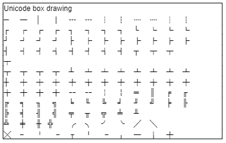

  

Show Code

```puml
@startsalt

{+Unicode box drawing                                                                                                                           
    ─	━	│	┃	┄	┅	┆	┇	┈	┉	┊	┋ 
┌	┍	┎	┏	┐	┑	┒	┓	└	┕	┖	┗
┘	┙	┚	┛	├	┝	┞	┟	┠	┡	┢	┣
┤	┥	┦	┧	┨	┩	┪	┫	┬	┭	┮
  ┯
┰	┱	┲	┳	┴	┵	┶	┷	┸	┹	┺	┻
┼	┽	┾	┿	╀	╁	╂	╃	╄	╅	╆	╇
╈	╉	╊	╋	╌	╍	╎	╏	═	║	╒	╓
╔	╕	╖	╗	╘	╙	╚	╛	╜	╝	╞	╟
╠	╡	╢	╣	╤	╥	╦	╧	╨
  ╩	╪	╫ ╬	╭	╮	╯	╰	╱	╲
  ╳	╴	╵	╶	╷ ╸	╹	╺	╻	╼	╽	╾╿
  
}
@endsalt
```

 
 

  ### Window

  

Show Code

  
```puml
@startsalt
skinparam backgroundcolor #FEFFFF
{ 
    {+


{*  Window Title                                                                                        🗔  X}
' Header
    { 
{}
    {+ 🔒  https://host.subdomain.domain.com   }
  
' LeftNav
{}
    {T 
        + Item
        + Item
        ++ Item
        ++ Item
        ++ Item
        + Item
        + Item
        ++ Item
        ++ Item
        ++ Item
        + Item
        ++ Item
        ++ Item
        ++ Item
        ++ Item
        ++ Item
        ++ Item
        ++ Item
        ++ Item
        ++ Item

    }|
' MainPanel


' endMainPanel

    }

}
<b>RBAC:</b> Groups
<b>Good/Better/Best</b>: Level
}


@endsalt
```

### Wizard

  

Show Code

  
```puml
@startsalt
skinparam backgroundcolor #FEFFFF

{
{*  Wizard}
{+
'Left Menu
{/
    Step 1    
    <b>Step 2    
    <color:gray>Step 3    
}|
{
    { 
      <b>Step Name
            {.}

        {
          Attribute:  | "User-defined value  " 
          <i>Note |          {<i>Lorem ipsum 
        <i>Lorem iupsum}
        {.}
        Textbox  |
        {SI
    something for the user to type into
    
                                           
}
        {.}
        () Bullet| 
        (X) Bullet
        [ ] check|
        [X] Check
          
{.}
        {
        }
        } 
        

    }
    --
{                                                 |[Back] | [Next]|}
}
}
}
@endsalt
```

### Modal

  

Show Code

  
```puml
@startsalt
skinparam backgroundcolor #FEFFFF

{
{*  Modal}
{+

{
    { 
      <b>Step Name
            {.}

        {
          Attribute:  | "User-defined value  " 
          <i>Note |          {<i>Lorem ipsum 
        <i>Lorem iupsum}
        {.}
        Textbox  |
        {SI
    something for the user to type into
    
                                           
}
        {.}
        () Bullet| 
        (X) Bullet
        [ ] check|
        [X] Check
          
{.}
        {
        }
        } 
        

    }
    --
{                                                 |[Back] | [Next]|}
}
}
}
@endsalt
```

### Hierarchical Table

  

Show Code

  
```puml
@startsalt
{<b> Table Name
    {
        {
        {[Action]|  |
        ^ Menu ^|
        ^ Menu ^^ Option 1 ^^ Option 2 ^}
    }
      
    {                             🝖 ▥ ⟳  }
    
    {T-
        ☐ <b>Column|<b>Column |<b>Column |<b> Column | <b>Column
        ☐ 1Level|  ✅ |  Attribute       |Attribute | Attribute Attribute
        ++ ☐ 2Level|  ✅ |  Attribute       |Attribute| Attribute Attribute
        ++ ☐ 2Level|  ⚠️ | Attribute      |Attribute| Attribute Attribute
        +++ ☐ 3Level|❌| Attribute      |Attribute| Attribute Attribute
        ☑ 1Level|  ✅ |  Attribute       |Attribute | Attribute Attribute
        ☐ 1Level|  ✅ |  Attribute       |Attribute | Attribute Attribute
        ++ ☑ 2Level|  ✅ |  Attribute       |Attribute| Attribute Attribute
        ++ ☑ 2Level|  ⚠️ | Attribute      |Attribute| Attribute Attribute
        +++ ☑ 3Level|❌| Attribute      |Attribute| Attribute Attribute
        ☐ 1Level|  ✅ |  Attribute       |Attribute | Attribute Attribute
        ++ ☐ 2Level|  ✅ |  Attribute       |Attribute| Attribute Attribute
        ++ ☐ 2Level|  ✅ | Attribute      |Attribute| Attribute Attribute
        +++ ☐ 3Level|✅| Attribute      |Attribute| Attribute Attribute
}
{.}
}
}
@endsalt
```

### Flat Table

  

Show Code

  
```puml
@startsalt
{
    <b> Table Name
                                      🝖 ▥ ⟳
    {T-
        ☐ <b>Column|<b>Column |<b>Column |<b> Column | <b>Column
        ☐ 1Level|  ✅ |  Attribute       |Attribute | Attribute Attribute
         ☐ 2Level|  ✅ |  Attribute       |Attribute| Attribute Attribute
         ☐ 2Level|  ⚠️ | Attribute      |Attribute| Attribute Attribute
         ☐ 3Level|❌| Attribute      |Attribute| Attribute Attribute
        ☑ 1Level|  ✅ |  Attribute       |Attribute | Attribute Attribute
        ☐ 1Level|  ✅ |  Attribute       |Attribute | Attribute Attribute
         ☑ 2Level|  ✅ |  Attribute       |Attribute| Attribute Attribute
         ☑ 2Level|  ⚠️ | Attribute      |Attribute| Attribute Attribute
         ☑ 3Level|❌| Attribute      |Attribute| Attribute Attribute
        ☐ 1Level|  ✅ |  Attribute       |Attribute | Attribute Attribute
         ☐ 2Level|  ✅ |  Attribute       |Attribute| Attribute Attribute
         ☐ 2Level|  ✅ | Attribute      |Attribute| Attribute Attribute
         ☐ 3Level|✅| Attribute      |Attribute| Attribute Attribute
}
}
@endsalt
```

### Tabbed Interface

  

Show Code

  
```puml
@startsalt
{{
  {/ Tab  | Tab | Tab | <b>Selected Tab }

{.}
Message to the user
--
{
          Attribute:  | "User-defined value  " 
          <i>Note |          {<i>Lorem ipsum 
        <i>Lorem iupsum}
        {.}
        Textbox  |
        {SI
    something for the user to type into
    
                                           
}
        {.}
        () Bullet| 
        (X) Bullet
        [ ] check|
        [X] Check
        
          
{.}
        {
        }
        } 
        
    }
    
{                                    |[Cancel]| [Action]}}

@endsalt
```

### Unicode

```puml
@startsalt
{+Unicode
  {🗀
  🗔
  𝄘
  🝖 ▥ ⟳
  ©
  ®
  ⏴
  ⏵
  ⏶
  ⏷
  ⛔
  ✅
  ✨
  ❌
  ❎
  {➕  |
  ➖}
  }|
{ ❗
  ❕
  ❔
  ❓
  ⭐
  ⭕
  {🔁 🔃  📶  🔀  🔂  🔄   }
  {🔓 |
  🔒 |
  🔑}
  {🔔 |
  🔕}
  }
}
@endsalt
```
  

### Dashboard Layout

  

Show Code

  
```puml
@startsalt
{
{^==bubble

  <img:https://raw.githubusercontent.com/pgaljan/dac/main/img/bubble.png>
 
 
 
 
 
{}
}|
    {^==map
                                                                  
  <img:https://raw.githubusercontent.com/pgaljan/dac/main/img/map.png>

 { }
}


{^==scatter
 
  <img:https://raw.githubusercontent.com/pgaljan/dac/main/img/scatter.png>
  }|
  {^==veritcal bar
 
 <img:https://raw.githubusercontent.com/pgaljan/dac/main/img/vbar.png>
 }
{^==horizontal bar
 
 <img:https://raw.githubusercontent.com/pgaljan/dac/main/img/hbar.png>
}|
  {^==line
 
 <img:https://raw.githubusercontent.com/pgaljan/dac/main/img/line.png>
}
  {^==graph
 
 <img:https://raw.githubusercontent.com/pgaljan/dac/main/img/graph.png>
}

}

@endsalt

```

## Unicode

 show snippets

### common ui

```plantuml
@startsalt
{+common ui
  {
{
    🗀  ⚙
  ▁  🗔   🗙
  𝄘 ≡ ☰
  🗕  ⤓  ⤒  🔗  
  🝖 ▥ 
  	↩ ↪ ↶  ↷
  🡐 ⟳ ⌂ ⟰
  🛇 🛈  © ®
  ⏴ ⏵  ⏶  ⏷
   ⌨ ⌧ ⌦ ⏱
  ⏭   ⏮    ⏯
  ▣ ◼ ☑ ▢ 
  ⦿  🔘☢ ◉
  ✂ ⎘  🛆
  }|
{
{    
  ← ↑ → ↓ 
  ↔ ↕ 
  ⇤ ⇥ ⤒ ⤓
  ↖ ↗ ↘ ↙ 
  ⤸ ⤹ ⤺ ⤻
  ⤴ ⤵ ⤶ ⤷	
☰ ☱ ☲ ☳	
☴ ☵ ☶ ☷
♺ ♻ ♼
⚐ ⚑

𝄘 𝄙 𝄚 𝄛
}|
{

🕐 🕑 🕒       🕓 
🕔 🕕 🕖       🕗
🕘 🕙 🕚       🕛 
🕜 🕝 🕞       🕟
🕠 🕡 🕢       🕣
🕤 🕥 🕦       🕧
① ② ③ ④ 
  ⑤ ⑥ ⑦ ⑧ 
  ⑨ ⑩ ⑪ ⑫ 
  ⑬ ⑭ ⑮ ⑯ 
  ⑰ ⑱ ⑲ ⑳
  }
}
  }|
  {
  ❗❕  ❔  ❓  ⭐        ⭕
  🔁 🔃  📶   🔀  🔂     🔄
  🆕   ℹ️   ⚠️  ❌  ⛔ 💡
  🔓    🔒   🔑
    ⛔    ✅  ✨    ❎ ⭐
  ➕     ➖ 🟰
   🔔      🔕 ⌛

  ⌚    ⌛    🚩  🚫  🚀
  ⏩   ⏪   ⏫     ⏬
  🔎   🔍     🍳  📍    📌
  
  }|

}
@endsalt
```

### miscellaneous

```plantuml
@startsalt

{+miscellaneous
☀	☁	☂	☃	☄	★	☆	☇	☈	☉	☊	☋	☌	☍	☎	☏
☐	☑	☒	☓	☔	☕	☖	☗	☘	☙	☚	☛	☜	☝	☞	☟
☠	☡	☢	☣	☤	☥	☦	☧	☨	☩	☪	☫	☬	☭	☮	☯
☰	☱	☲	☳	☴	☵	☶	☷	☸	☹	☺	☻	☼	☽	☾	☿
♀	♁	♂	♃	♄	♅	♆	♇	♈	♉	♊	♋	♌	♍	♎	♏
♐	♑	♒	♓	♔	♕	♖	♗	♘	♙	♚	♛	♜	♝	♞	♟
♠	♡	♢	♣	♤	♥	♦	♧	♨	♩	♪	♫	♬	♭	♮	♯
♰	♱	♲	♳	♴	♵	♶	♷	♸	♹	♺	♻	♼	♽	♾	♿
⚀	⚁	⚂	⚃	⚄	⚅	⚆	⚇	⚈	⚉	⚊	⚋	⚌	⚍	⚎	⚏
⚐	⚑	⚒	⚓	⚔	⚕	⚖	⚗	⚘	⚙	⚚	⚛	⚜	⚝	⚞	⚟
⚠	⚡	⚢	⚣	⚤	⚥	⚦	⚧	⚨	⚩	⚪	⚫	⚬	⚭	⚮	⚯
⚰	⚱	⚲	⚳	⚴	⚵	⚶	⚷	⚸	⚹	⚺	⚻	⚼	⚽	⚾	⚿
⛀	⛁	⛂	⛃	⛄	⛅	⛆	⛇	⛈	⛉	⛊	⛋	⛌	⛍	⛎	⛏
⛐	⛑	⛒	⛓	⛔	⛕	⛖	⛗	⛘	⛙	⛚	⛛	⛜	⛝	⛞	⛟
⛠	⛡	⛢	⛣	⛤	⛥	⛦	⛧	⛨	⛩	⛪	⛫	⛬	⛭	⛮	⛯
⛰	⛱	⛲	⛳	⛴	⛵	⛶	⛷	⛸	⛹	⛺	⛻	⛼	⛽	⛾	⛿

  
}
@endsalt
```

### arrows

```plantuml
@startsalt
{+arrows
	←	↑	→	↓	↔	↕	↖	↗	
	↘	↙	↚	↛	↜	↝	↞	↟
	↠	↡	↢	↣	↤	↥	↦	↧	
	↨	↩	↪	↫	↬	↭	↮	↯
	↰	↱	↲	↳	↴	↵	↶	↷	
	↸	↹	↺	↻	↼	↽	↾	↿
	⇀	⇁	⇂	⇃	⇄	⇅	⇆	⇇	
	⇈	⇉	⇊	⇋	⇌	⇍	⇎	⇏
	⇐	⇑	⇒	⇓	⇔	⇕	⇖	⇗	
	⇘	⇙	⇚	⇛	⇜	⇝	⇞	⇟
	⇠	⇡	⇢	⇣	⇤	⇥	⇦	⇧	
	⇨	⇩	⇪	⇫	⇬	⇭	⇮	⇯
	⇰	⇱	⇲	⇳	⇴	⇵	⇶	
	⇷	⇸	⇹	⇺	⇻	⇼	
	⇽	⇾	⇿
}
@endsalt
```

### geometric

```plantuml
@startsalt
{+ geometric
■	□	▢	▣	▤	▥	▦	▧	▨	▩	
▪	▫	▬	▭	▮	▯	▰	▱	▲	△	
▴	▵	▶	▷	▸	▹	►	▻	▼	▽	
▾	▿	◀	◁	◂	◃	◄	◅	◆	◇	
◈	◉	◊	○	◌	◍	◎	●	
◐	◑	◒	◓	◔	◕	◖	◗	◘	◙	
◚	◛	◜	◝	◞	◟	◠	◡	◢	◣	
◤	◥	◦	◧	◨	◩	◪	◫	◬	◭	
◮	◯	◰	◱	◲	◳	◴	◵	◶	◷	
◸	◹	◺	◻	◼	◽	◾	◿
}
@endsalt

```

### blocks

```plantuml
@startsalt

{+ blocks
    ▀ ▁ ▂ ▃ ▄ ▅ ▆ ▇ █ ▉ ▊ ▋ ▌ ▍ ▎ ▏  

▒ ▓  ▔▕ ▖ ▗ ▘ ▙ ▚ ▛ ▜ ▝ ▞ ▟
}
@endsalt

```

### dingbats

```plantuml
@startsalt

{+dingbats
✀	✁	✂	✃	✄	✅	✆	✇	✈	✉	
✊	✋	✌	✍	✎	✏	✐	✑	✒	
✓	✔	✕	✖	✗	✘	✙	✚	✛	✜	✝	
✞	✟	✠	✡	✢	✣	✤	✥	✦	✧	✨	
✩	✪	✫	✬	✭	✮	✯	✰	✱	✲	✳	
✴	✵	✶	✷	✸	✹	✺	✻	✼	✽	✾	
✿	❀	❁	❂	❃	❄	❅	❆	❇	❈	❉	
❊	❋	❌	❍	❎	❏	❐	❑	❒	❓	
❔	❕	❖	❗	❘	❙	❚	❛	❜	❝	❞	❜	
❠	❡	❢	❣	❤	❥	❦	❧	❨	❩	❪	❫	
❬	❭	❮	❯	❰	❱	❲	❳	❴	❵	
❶	❷	❸	❹	❺	❻	❼	❽	❾	❿	
➀	➁	➂	➃	➄	➅	➆	➇	➈	➉	
➊	➋	➌	➍	➎	➏	➐	➑	➒	➓	
➔	➕	➖	➗	➘	➙	➚	➛	➜	➝	
➞	➟	➠	➡	➢	➣	➤	➥	➦	➧	➨	
➩	➪	➫	➬	➭	➮	➯	➰	➱	➲	➳	
➴	➵	➶	➷	➸	➹	➺	➻	➼	➽	➾	➿

}
@endsalt

```

### enclosed alpahnumeric

```plantuml
@startsalt
{+enclosed alphanumeric 	

①	②	③	④	⑤	⑥	⑦	⑧	⑨	⑩	⑪	⑫	⑬	⑭	⑮	⑯
⑰	⑱	⑲	⑳	⑴	⑵	⑶	⑷	⑸	⑹	⑺	⑻	⑼	⑽	⑾	⑿
⒀	⒁	⒂	⒃	⒄	⒅	⒆	⒇	⒈	⒉	⒊	⒋	⒌	⒍	⒎	⒏
⒐	⒑	⒒	⒓	⒔	⒕	⒖	⒗	⒘	⒙	⒚	⒛	⒜	⒝	⒞	⒟
⒠	⒡	⒢	⒣	⒤	⒥	⒦	⒧	⒨	⒩	⒪	⒫	⒬	⒭	⒮	⒯
⒰	⒱	⒲	⒳	⒴	⒵	Ⓐ	Ⓑ	Ⓒ	Ⓓ	Ⓔ	Ⓕ	Ⓖ	Ⓗ	Ⓘ	Ⓙ
Ⓚ	Ⓛ	Ⓜ	Ⓝ	Ⓞ	Ⓟ	Ⓠ	Ⓡ	Ⓢ	Ⓣ	Ⓤ	Ⓥ	Ⓦ	Ⓧ	Ⓨ	Ⓩ
ⓐ	ⓑ	ⓒ	ⓓ	ⓔ	ⓕ	ⓖ	ⓗ	ⓘ	ⓙ	ⓚ	ⓛ	ⓜ	ⓝ	ⓞ	ⓟ
ⓠ	ⓡ	ⓢ	ⓣ	ⓤ	ⓥ	ⓦ	ⓧ	ⓨ	ⓩ	⓪	⓫	⓬	⓭	⓮	⓯
⓰	⓱	⓲	⓳	⓴	⓵	⓶	⓷	⓸	⓹	⓺	⓻	⓼	⓽	⓾	⓿
}
@endsalt
```

### blocks

